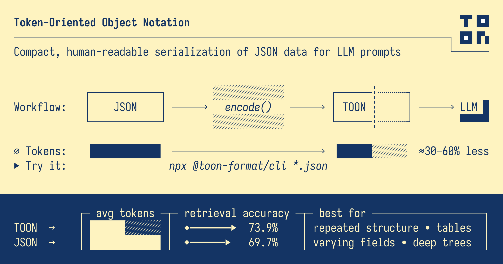

# トークン指向オブジェクト表記 (TOON)

[](https://github.com/toon-format/toon/actions)
[](https://www.npmjs.com/package/@toon-format/toon)
[](https://github.com/toon-format/spec)
[](https://www.npmjs.com/package/@toon-format/toon)
[](./LICENSE)

**Token-Oriented Object Notation（TOON）** は、LLM（大規模言語モデル）のプロンプト向けにトークン効率を高めた、可読性のある JSON 相当の表現です。JSON と同じ情報を損失なく表現しつつ、トークン数を少なく抑えるための構文を採用しています。

TOON は YAML ライクなインデント構造と、均一な配列に対する CSV ライクな表形式を組み合わせています。特に同一構造のオブジェクト配列（各行が同じフィールドを持つ）で効果を発揮し、CSV と同等のコンパクトさを保ちながら構造情報を明示して LLM の解析や検証を容易にします。深くネストしたり不均一な構造では JSON の方が適している場合があります。

考え方としては「翻訳レイヤー」です：プログラム内部では JSON を使い、LLM へ渡す際に TOON にエンコードします。

> [!TIP]
> TOON は実運用対応を目指した実装ですが、仕様や挙動は進化中です。仕様提案やフィードバックは [spec リポジトリ](https://github.com/toon-format/spec) にて歓迎します。

## 目次

- [なぜ TOON か？](#なぜ-toonか)
- [主な特徴](#主な特徴)
- [TOON を避けるべき状況](#toon-を避けるべき状況)
- [ベンチマーク](#ベンチマーク)
- [インストールとクイックスタート](#インストールとクイックスタート)
- [Playground](#playground)
- [CLI](#cli)
- [フォーマット概観](#フォーマット概観)
- [API](#api)
- [LLM プロンプトでの利用方法](#llm-プロンプトでの利用方法)
- [構文チートシート](#構文チートシート)
- [他言語実装](#他言語実装)
- [完全仕様](https://github.com/toon-format/spec/blob/main/SPEC.md)

## なぜ TOON か？

大規模コンテキストを扱えるようになった一方で、LLM のトークンコストは依然として重要です。標準的な JSON は冗長になりがちです。

YAML でもトークン数は減りますが、TOON はさらに少ないトークンで同じ情報を表現できます。以下は TOON の例です。

```toon
context:
  task: Our favorite hikes together
  location: Boulder
  season: spring_2025

friends[3]: ana,luis,sam

hikes[3]{id,name,distanceKm,elevationGain,companion,wasSunny}:
  1,Blue Lake Trail,7.5,320,ana,true
  2,Ridge Overlook,9.2,540,luis,false
  3,Wildflower Loop,5.1,180,sam,true
```

## 主な特徴

- 💸 **トークン効率**：大きな均一テーブルで通常 30〜60% のトークン削減を期待できます。
- 🤿 **LLM フレンドリーなガードレール**：配列長（`[N]`）やフィールド一覧（`{...}`）により検証が可能。
- 🍱 **最小限の構文**：冗長な中括弧や括弧、不要な引用を省略。
- 📐 **インデントベースの構造**：YAML のようにインデントでネストを表現。
- 🧺 **タブular 配列**：同一フィールドのオブジェクト群をヘッダー一回で表現。
- 🔗 **キー折りたたみ（Key folding）**：単一キーのチェーンをドット区切りに折りたたんでトークンを削減（オプション）。

## TOON を避けるべき状況

- 深くネストした不均一な構造：タブular 適合率が低く、JSON の方が効率的な場合があります。
- 準均一な配列（40〜60%）：トークン節約のメリットが薄れます。
- 完全にフラットな表形式（純粋な CSV の方が小さい）
- レイテンシ重視のケース：環境によっては JSON の方が速いことがあります。実際のワークロードでベンチマークしてください。

## ベンチマーク

ベンチマークは 2 トラックで構成されます：混合構造トラック（Nested を含む）とフラット専用トラック（CSV 比較）。
結果や手法は `benchmarks/` に格納されています。

（詳細な比較・結果は英語版 `README.md` や `benchmarks/` を参照してください）

## インストールとクイックスタート

### CLI（インストール不要）

```bash
# JSON→TOON
npx @toon-format/cli input.json -o output.toon

# stdin 経由
echo '{"name": "Ada", "role": "dev"}' | npx @toon-format/cli
```

### TypeScript ライブラリ

```bash
# pnpm
pnpm add @toon-format/toon
```

使用例：

```ts
import { encode } from '@toon-format/toon'

const data = {
  users: [
    { id: 1, name: 'Alice', role: 'admin' },
    { id: 2, name: 'Bob', role: 'user' }
  ]
}

console.log(encode(data))
// users[2]{id,name,role}:
//   1,Alice,admin
//   2,Bob,user
```

## CLI

```bash
npx @toon-format/cli [options] [input]
```

- 標準入力は引数なしまたは `-` で利用可能。
- ファイル拡張子で自動判定（`.json` → encode, `.toon` → decode）。stdin の場合は `--encode`/`--decode` を使えます。

主要オプション（抜粋）:

| オプション | 説明 |
|---|---|
| `-o, --output <file>` | 出力ファイル（省略時は stdout） |
| `-e, --encode` | 強制エンコード |
| `-d, --decode` | 強制デコード |
| `--delimiter <char>` | 配列区切り: `,`, `\t`, `\|` |
| `--indent <number>` | インデント幅（デフォルト 2） |
| `--stats` | エンコード時にトークン見積もりを表示 |
| `--no-strict` | デコード時の厳密検証を無効化 |
| `--key-folding <mode>` | `off`/`safe`（折りたたみ） |
| `--flatten-depth <number>` | 折りたたみの最大深度 |
| `--expand-paths <mode>` | `off`/`safe`（パス展開） |

## フォーマット概観

（要点のみ）

- オブジェクトは `key: value` 行で表現され、ネストはインデントで表します。
- 配列は長さを `key[N]:` で示し、プリミティブ配列は行内に並べます：`tags[3]: a,b,c`。
- オブジェクト配列が全て同一フィールドかつプリミティブ値のみの場合、ヘッダーでフィールドを宣言して行を並べるタブular 形式になります：

```
items[2]{sku,qty,price}:
  A1,2,9.99
  B2,1,14.5
```

- 空配列は `items[0]:`、空オブジェクトは（何も出力しないか）`config:` のようになります。

### 引用ルール

必要な場合のみ引用します（先頭/末尾空白、区切り文字を含む場合など）。代替区切り（タブ/パイプ）使用時はその区切り文字に合わせて引用ルールが適用されます。

### 型変換

- `NaN` / `Infinity` → `null`
- `BigInt` は安全範囲なら数値、それ以外は文字列として出力
- `Date` は ISO 文字列
- `undefined` / 関数 / シンボル → `null`

## API

### `encode(value: unknown, options?: EncodeOptions): string`

任意の JSON 互換値を TOON 文字列に変換します。オプションで `indent`、`delimiter`、`keyFolding` などを指定できます。

### `decode(input: string, options?: DecodeOptions): JsonValue`

TOON 文字列を JavaScript 値に復号します。デフォルトは厳密モード（配列長や行数の検証を行う）です。

## LLM プロンプトでの利用

入力として TOON を渡すときはコードブロック（```toon）で囲むと分かりやすいです。配列長（`[N]`）とフィールド（`{...}`）があるとモデルは構造を追いやすくなります。

出力として TOON を生成してもらう場合は、ヘッダー行を示してからモデルに行を埋めさせると生成ミスが減ります（例：`users[3]{id,name,role}:` を示す）。

## チートシート（抜粋）

```text
{ id: 1, name: 'Ada' }          → id: 1
                                    name: Ada

['x', 'y']                      → [2]: x,y

{ items: [] }                   → items[0]:
```

## 他言語実装

仕様は [toon-format/spec](https://github.com/toon-format/spec) にあります。多言語実装（Go, Rust, Python など）がコミュニティで進行中です。

## ライセンス

MIT © 2025-PRESENT Johann Schopplich

---

（英語 README の詳細な例やベンチマーク結果は英語版 `README.md` を参照してください。）
